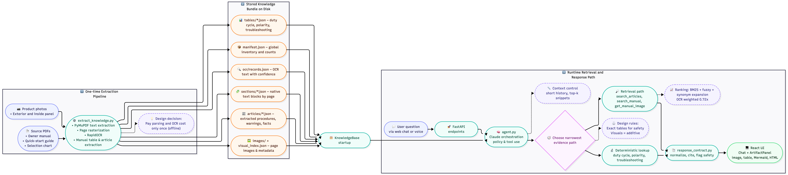

# Vulcan OmniPro 220 Multimodal Product Agent

### Watch the Demo video by clicking link below:

[MARS:Machine Assistance & Resolution System](https://youtu.be/yuOQoFR6Lp0) Demo

This is my submission for the Prox founding engineer challenge.

The project is a multimodal assistant for the Vulcan OmniPro 220 welder. It answers grounded questions using the owner manual, quick-start guide, selection chart, targeted OCR over visual pages, curated structured tables, and a chat UI that can return not just text, but also images, tables, Mermaid flows, interactive HTML artifacts, and optional voice responses.

The goal was not to build a generic PDF chatbot. The goal was to build a product-support agent for a dense, visual, safety-sensitive physical machine.

## What It Does

The assistant is optimized for the kinds of questions that matter for this product:

- setup and polarity questions
- duty cycle lookups
- troubleshooting weld defects
- front-panel control explanations
- “show me the page / chart / diagram” requests
- questions where a visual output is more useful than prose alone

The answer path is grounded. Product-specific factual claims are expected to come from local tools over the extracted knowledge bundle, not from the model’s prior knowledge.

## Quick Setup

### Prerequisites

- Python 3.12+
- Node.js 20+
- `uv`
- `npm`

### 1. Configure environment

```bash
cp .env.example .env
```

Minimum required environment variables:

```env
ANTHROPIC_API_KEY=sk-ant-...
ANTHROPIC_MODEL=claude-sonnet-4-6
OPENAI_API_KEY=sk-...
VOICE_STT_PROVIDER=openai
VOICE_TTS_PROVIDER=openai
OPENAI_TTS_MODEL=gpt-4o-mini-tts
OPENAI_TTS_VOICE=ash
```

### 2. Install dependencies

Backend:

```bash
uv sync
```

Frontend:

```bash
cd frontend
npm install
cd ..
```

### 3. Run the app

Start the backend:

```bash
PYTHONPATH=src uv run uvicorn prox_agent.api:app --port 8000 --reload
```

Start the frontend in a second terminal:

```bash
cd frontend
npm run dev
```

Open the Vite URL shown in the terminal, typically:

```text
http://localhost:5173
```

The frontend talks to `http://localhost:8000` by default. If your backend is elsewhere, set `VITE_API_BASE` in the frontend environment.

### 4. Optional smoke test

```bash
PYTHONPATH=src uv run python -m prox_agent.cli smoke
```

This validates the local knowledge bundle, deterministic lookups, OCR-backed retrieval, and image retrieval before using the full app.

## How the Agent Works

The system has two phases:

1. offline knowledge extraction into a local bundle
2. online question answering over that bundle

### High-level architecture



At runtime, the model does not read the whole manual. It chooses a narrow tool, the backend returns only the top local evidence for that question, and the model answers from that evidence.

The shipped web app uses Anthropic’s streaming tool-use API directly for tight control over:

- streaming UX
- local tool execution
- artifact metadata
- voice playback timing

The same knowledge layer is also exposed through MCP-compatible tool wrappers in `src/prox_agent/sdk_tools.py`.

## Knowledge Extraction and Representation

The local knowledge bundle lives under:

```text
products/vulcan-omnipro-220/knowledge/
```

It is built from:

- `files/owner-manual.pdf`
- `files/quick-start-guide.pdf`
- `files/selection-chart.pdf`
- product photos in the repo root

The bundle contains several layers:

### 1. Native page text

Stored in:

```text
knowledge/sections/*.json
```

Each page record contains page text, metadata, and block extraction data. Runtime manual search currently ranks at the page level.

### 2. Rasterized page images

Stored in:

```text
knowledge/pages/<doc_id>/page-XXX.png
```

These power:

- visual artifacts
- OCR
- image-based retrieval
- page display in the UI

### 3. Targeted OCR

Stored in:

```text
knowledge/ocr/targets.json
knowledge/ocr/records.json
```

I use targeted OCR rather than OCR over every page. The intention is to recover high-value visual text where native PDF extraction is weak, especially for:

- the selection chart
- quick-start pages
- front-panel labels
- important setup/troubleshooting visuals

### 4. Structured articles

Stored in:

```text
knowledge/articles/*.json
```

These are LLM-generated structured summaries built from clusters of owner-manual pages. They contain:

- summaries
- key facts
- procedure steps
- warnings
- source references
- search terms

These are used for procedural and explanatory questions where a structured answer is more useful than raw snippets.

### 5. Visual metadata

Stored in:

```text
knowledge/images/visual_index.json
knowledge/images/visual_index_full.json
```

This layer maps user intent like “show me the TIG polarity setup” to a relevant page or figure using titles, descriptions, visible text, and query terms.

### 6. Verified structured tables

Stored in:

```text
knowledge/tables/duty_cycles.json
knowledge/tables/polarity_setups.json
knowledge/tables/troubleshooting_guides.json
```

These are the most important structured facts in the system. They are used for the highest-stakes machine-specific answers.

### Retrieval and Reasoning Strategy

This project does not use embeddings. It uses a local lexical retrieval stack based on:

- BM25
- fuzzy matching
- domain-specific synonym expansion
- deterministic exact lookups for critical facts

### BM25

BM25 is the primary ranker for:

- native page text
- OCR records
- structured article search text

This fits the domain well because welding questions often rely on exact technical language:

- TIG
- MIG
- DCEP
- DCEN
- duty cycle
- porosity
- inductance
- wire feed

### Fuzzy matching

RapidFuzz is used as a side score to help with:

- partial phrase overlap
- different word order
- less exact user wording

### Synonym expansion

Before ranking, certain domain queries are expanded. Examples:

- `tig` -> `gtaw`, `tungsten`, `torch`
- `mig` -> `gmaw`, `solid core`, `gas shielded`
- `flux-cored` -> `fcaw`, `gasless`, `self-shielded`
- `ground` -> `work clamp`, `ground clamp`

That helps bridge the gap between user language and manual language without needing an embeddings system.

## How the Agent Decides What to Read

There are two levels of selection:

### 1. Tool selection

The model chooses among a small set of local tools:

- `search_manual`
- `search_articles`
- `lookup_duty_cycle`
- `lookup_polarity`
- `troubleshooting_for`
- `get_manual_image`

The system prompt strongly steers the model toward the narrowest evidence path:

- exact tables for duty cycle and polarity
- article retrieval for procedures and warnings
- raw manual search for cited snippets
- image retrieval when a diagram or page is more actionable than prose

### 2. Top-k retrieval inside the tool

The model does not get the whole corpus.

Instead:

- `search_manual` returns only top page/OCR snippets
- `search_articles` returns only top article objects
- `get_manual_image` returns only top visual matches
- exact lookups return one row or a small result set

So the server indexes the full knowledge bundle locally, but the model only reads the selected evidence for the current question.

## Chat History and Context

The frontend stores full chats in browser local storage and sends the full active conversation with each request.

The backend does not forward all of that to Anthropic. It trims the history to the last 10 messages before sending the model request.

That was a deliberate latency and cost tradeoff, but it means:

- the UI remembers more than the model does
- long troubleshooting sessions can lose older context
- there is no server-side long-term memory layer
- current-turn images are sent to the model, prior-turn images are not replayed

## Frontend Experience

The frontend is a React + Vite app with:

- persisted chats via Zustand
- streaming assistant responses
- artifact tabs
- markdown rendering
- image, table, Mermaid, and interactive HTML rendering
- optional voice capture and streamed playback

This matters because for this product, the right answer format often is not a paragraph. A polarity answer should show a diagram. A troubleshooting answer should often be a flow. A settings answer can be more useful as a structured artifact than as plain prose.

## Key Design Decisions

### 1. Pay parsing cost offline, not at request time

The manuals are dense and image-heavy. I chose to materialize a local knowledge bundle ahead of time instead of parsing PDFs during every request.

This gives:

- lower runtime latency
- easier debugging
- a clearer separation between content quality and model behavior

### 2. Use deterministic structured data for safety-critical facts

For duty cycle, polarity, and core troubleshooting paths, I wanted exact machine-specific answers to come from structured verified data rather than from the model paraphrasing a page.

That improves:

- trustworthiness
- consistency
- debuggability

### 3. Prefer a tuned lexical retriever over embeddings

The corpus is small, static, and highly technical. BM25 plus fuzzy matching plus curated synonyms is simple, fast, and explainable.

For this use case, that was the right tradeoff.

### 4. Treat visual retrieval as first-class

The Vulcan OmniPro 220 manuals contain important information that is easier to act on visually than textually:

- cable setups
- the selection chart
- quick-start pages
- weld defect photos
- control labels

So I made image/page retrieval and artifact rendering part of the core answer path, not an afterthought.

### 5. Keep product knowledge separate from orchestration

I kept the product knowledge in local JSON plus a `KnowledgeBase` abstraction rather than encoding product behavior only in the prompt.

That gives:

- inspectable source data
- deterministic fallbacks
- reusable tools across CLI, API, and SDK-compatible paths
- a cleaner path to improving retrieval without changing the app surface

## What I Would Improve Next

If I continued the project, these are the first upgrades I would make.

### 1. Prebuilt deterministic artifacts for repeatable exact answers

Right now the model can generate artifacts dynamically, which is flexible, but it also means some artifact experiences can vary from user to user.

The clearest improvement is duty cycle.

Because duty cycle answers come from a verified structured table, I would move duty-cycle artifact generation into deterministic server-side rendering with a prebuilt polished component or HTML template.

That would give:

- the same verified experience for every user
- a more polished artifact because it would be designed once instead of regenerated each time
- less token waste, because the model would not need to rebuild the same calculator repeatedly

I would likely do the same over time for polarity/wiring diagrams and some troubleshooting flows.

### 2. Better long-session memory

Today the backend only forwards the last 10 messages to the model.

That is good for speed and cost, but not ideal for longer support conversations where the user may already have shared:

- material type
- thickness
- wire or rod choice
- gas setup
- prior troubleshooting steps

The next step would be a hybrid memory layer:

- keep recent turns verbatim
- summarize older state
- preserve structured setup facts across the session

### 3. Faster artifact generation

Artifacts are one of the most useful parts of the experience, but also one of the more expensive and variable parts of generation.

The fastest path would be to reduce how often the model has to invent artifact payloads from scratch.

The main directions I would pursue are:

- cache artifacts by deterministic inputs
- render common artifact types directly in application code
- use reusable templates for tables, diagrams, and calculators
- return text immediately and attach heavier artifacts as a second stage when needed

That would improve:

- latency
- consistency
- token efficiency
- polish

## Example Questions to Try

- What’s the duty cycle for MIG welding at 200A on 240V?
- What polarity setup do I need for TIG welding? Which socket does the ground clamp go in?
- I’m getting porosity in my flux-cored welds. What should I check first?
- Show me the quick-start cable setup page.
- What does Spot Timer do on the front panel?
- Show me the selection chart for choosing process and material thickness.


## Summary

This project is intentionally product-specific rather than generic.

The main choices reflect that:

- offline extraction instead of runtime PDF parsing
- deterministic structured tables for high-stakes facts
- local lexical retrieval tuned for technical vocabulary
- targeted OCR for visually important content
- visual and interactive artifacts as part of the core answer path
- optional voice for real-world hands-busy usage

That combination is what I think makes the assistant useful for this product, not just impressive as a demo.
