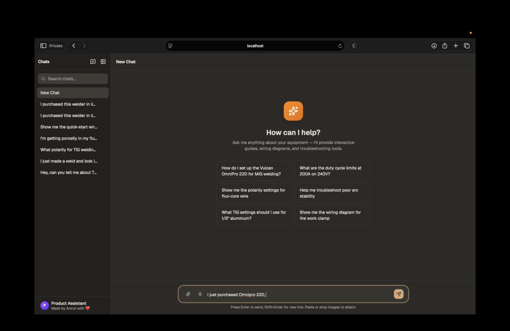
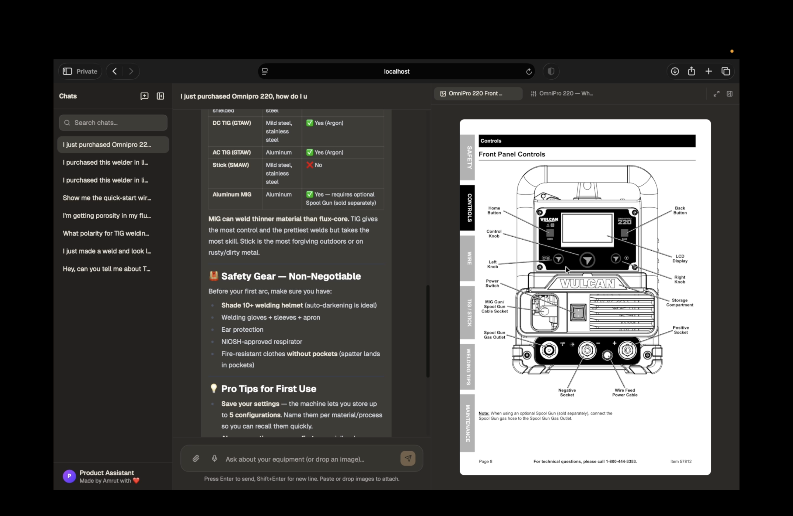
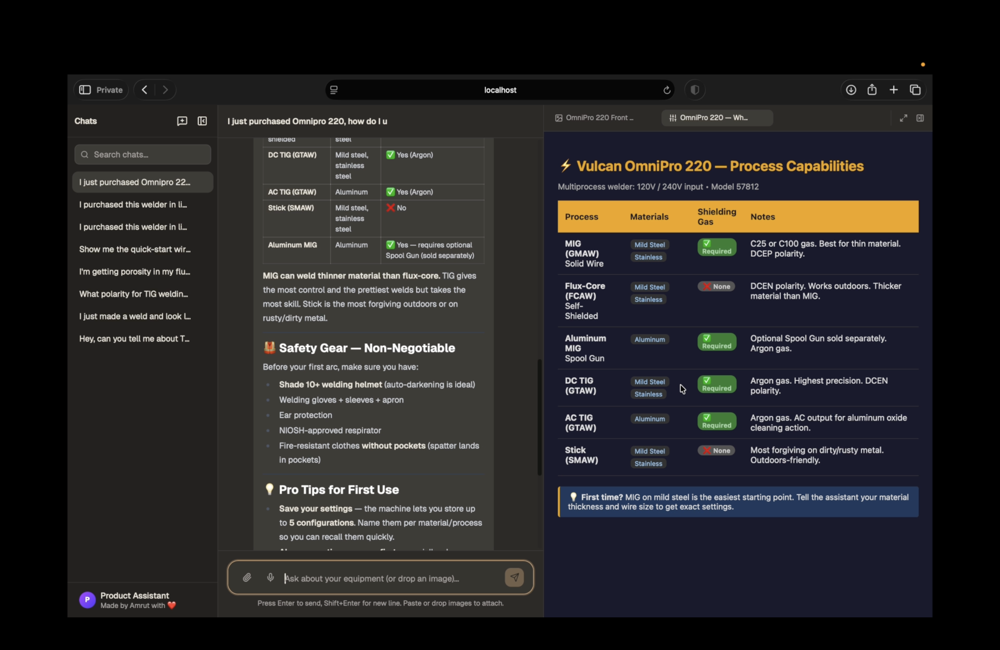
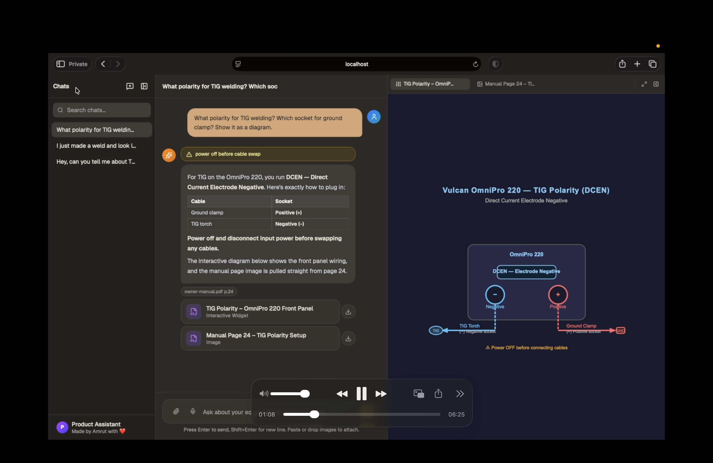
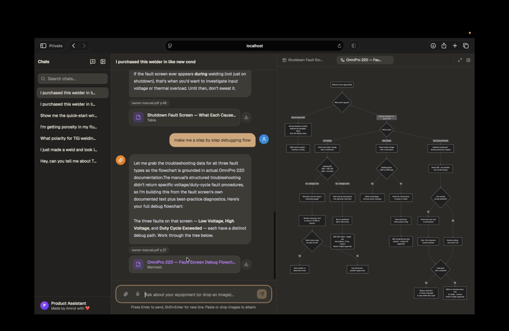

# Vulcan OmniPro 220 Multimodal Product Agent

A grounded product-support agent for the Vulcan OmniPro 220 welder that answers with the right evidence and the right format: cited manual snippets, diagrams, tables, Mermaid flows, interactive HTML, and optional voice.

This is my submission for the Prox founding engineer challenge.

## Demo

[MARS: Machine Assistance & Resolution System](https://youtu.be/t4jRS8UL12g)

## Frontend Screenshots

<p align="center">
  
  
</p>

<p align="center">
  
  
</p>

<p align="center">
  
</p>

## Table of Contents

- [Problem](#problem)
- [What It Does](#what-it-does)
- [Why This Is Different](#why-this-is-different)
- [Quick Start](#quick-start)
- [Example Questions to Try](#example-questions-to-try)
- [Architecture Snapshot](#architecture-snapshot)
- [Docs](#docs)

## Problem

The Vulcan OmniPro 220 is not a product where a generic PDF chatbot is enough.

The manuals are dense, visual, and safety-sensitive. Useful answers often depend on exact tables, control labels, wiring diagrams, quick-start pages, and troubleshooting visuals rather than on plain text alone.

This project is built to answer the kinds of questions a real owner asks:

- What polarity setup do I need for this process?
- What is the duty cycle at this amperage and voltage?
- Show me the quick-start page or wiring diagram.
- I am getting porosity or bad bead shape. What should I check first?

## What It Does

The assistant is optimized for:

- setup and polarity questions
- duty cycle lookups
- troubleshooting weld defects
- front-panel control explanations
- "show me the page / chart / diagram" requests
- answers where a visual artifact is more useful than prose

The answer path is grounded in local product knowledge. Product-specific claims are expected to come from local tools over extracted evidence, not from model memory.

## Why This Is Different

- It does offline knowledge extraction from the owner manual, quick-start guide, selection chart, targeted OCR, and curated structured tables.
- It uses narrow local tools for retrieval, so the model reads only the most relevant evidence instead of the whole manual.
- It can return images, tables, Mermaid flows, and interactive HTML when those formats are more useful than a paragraph.
- It keeps high-stakes machine facts such as duty cycle and polarity in deterministic structured data.

## Quick Start

For the fastest local setup, run:

macOS/Linux:

```bash
./scripts/setup.sh
```

Windows CMD:

```bat
scripts\setup.bat
```

Then:

Add your API keys to `.env`.

Start the backend:

```bash
PYTHONPATH=src uv run uvicorn prox_agent.api:app --port 8000 --reload
```

Start the frontend in a second terminal:

```bash
cd frontend
npm run dev
```

Full installation, environment variables, smoke test, and troubleshooting live in [guides/SETUP.md](guides/SETUP.md).

## Example Questions to Try

- What is the duty cycle for MIG welding at 200A on 240V?
- What polarity setup do I need for TIG welding? Which socket does the ground clamp go in?
- I am getting porosity in my flux-cored welds. What should I check first?
- Show me the quick-start cable setup page.
- What does Spot Timer do on the front panel?
- Show me the selection chart for choosing process and material thickness.

## Architecture Snapshot

The system has two phases:

1. Offline knowledge extraction into a local bundle.
2. Online question answering over that bundle.


At runtime, the model does not read the entire manual. It chooses a narrow tool, the backend returns only top local evidence for the current question, and the model answers from that evidence.

The shipped web app uses Anthropic's streaming tool-use API directly for tight control over streaming UX, local tool execution, artifact metadata, and voice playback timing.

## Docs

- [Setup Guide](guides/SETUP.md)
- [Architecture](guides/ARCHITECTURE.md)
- [Knowledge Pipeline](guides/KNOWLEDGE-PIPELINE.md)
- [Design Decisions](guides/DESIGN-DECISIONS.md)
- [Next Steps](guides/NEXT-STEPS.md)

## Summary

This project is intentionally product-specific rather than generic.

It combines offline extraction, deterministic structured data, visual retrieval, grounded tool use, and multimodal answers so the assistant can be useful for a real physical machine, not just impressive as a demo.
